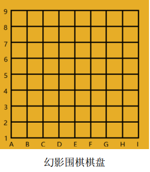

## 目录
- [目录](#目录)
- [比赛规则](#比赛规则)
- [使用方法](#使用方法)
  - [棋盘界面逻辑坐标](#棋盘界面逻辑坐标)


## 比赛规则

1. 幻影围棋比赛时，双方都无法看到对方的落子位置，对弈双方棋盘均为不完备信息棋盘，只有裁判能看见双方落子，并且拥有完全信息的对弈棋盘，该棋盘由对弈双方的棋盘取并集而成。  
   
2. 比赛胜负采用数子方法决定胜负。  
   
3. 黑白双方轮流落子，落子基本规则与围棋一致，其中气、禁招等概念相同。  
   
4. 所有程序都不能人工干预运行，如果采用手动输入方式进行比赛，比赛前双方应告知对方自己输入的命令方式和参数的意义，比赛过程中一方不能记录或输入对方落子的任何相关信息（包括非法、合法等信息），也不能由某方人工pass或者人工弃权，否则判定该队违规；如果在比赛过程中，某方选手自己操作失误，且无法复盘的情况下，则判该队此局为负，若该方能复盘（复盘时间不超过3分钟，复盘次数不超过1次，并在前面耗用的时间基础上加罚4分钟该方耗时），则比赛继续进行。  
   
5. 当某方落子后出现提子情况，裁判应根据完备信息的棋盘向双方返回提子数目和位置信息，双方同时更改盘面。  
   
6. 裁判可以看到完备信息棋盘，当一方落子，裁判应根据完备信息棋盘给予该落子为合法或者非法的信息。  
   
7. 当一方所有落子都返回illegal时就判断该方pass，直至双方都无法再落子，即双方都返回pass，本局结束，裁判应将死子做出标示，  
   
8. 幻影围棋计时：需要两个计时器，分别记录双方输入操作，程序运行及落子信息等总计消耗时间（触发时间：选手获得裁判允许开始计算本轮落子信息；结束时间：选手获得裁判返回落子位置合法信息（包括本轮所有计算出来为illegal落子或者pass的时间和裁决所耗时），提子计时计入被提子方（触发时间：裁判给出提子信息，结束时间：被提子方将所有被提子从己方棋盘正确移除）。  
   
9. 在比赛过程中如果出现了裁判操作或判断失误，导致对局无法正常进行。记录双方耗时并在3分钟内恢复局面，继续比赛，如果只有一方可恢复局面，另一方不能恢复局面则判不能恢复局面的一方为负。如果双方都不能恢复局面，则本局重赛。  
   
10. 双方都PASS后，由裁判标识出死子，判断双方做活的区域，剩下的公共区域为争议区域，争议区域由双方平分，如果出现平局，则判白子胜。  
    
11. 从赛程效率角度考虑，裁判可根据完全信息棋盘判断双方无法改变局面时，为了节省比赛时间，可以建议双方停止行棋，由裁判标识出死子后数子，如果有一方选手不同意停止行棋，则继续行棋。直到双方PASS或一方超时为止。

**棋盘**

<div style="text-align: center;">
    
</div>

## 使用方法
### 棋盘界面逻辑坐标

```
[[00, 01, 02, 03, 04, 05, 06, 07, 08],
 [10, 11, 12, 13, 14, 15, 16, 17, 18],
 [20, 21, 22, 23, 24, 25, 26, 27, 28],
 [30, 31, 32, 33, 34, 35, 36, 37, 38],
 [40, 41, 42, 43, 44, 45, 46, 47, 48],
 [50, 51, 52, 53, 54, 55, 56, 57, 58],
 [60, 61, 62, 63, 64, 65, 66, 67, 68],
 [70, 71, 72, 73, 74, 75, 76, 77, 78],
 [80, 81, 82, 83, 84, 85, 86, 87, 88]]
```
```
[[100 101 102 103 104 105 106 107 108]
 [ 89  90  91  92  93  94  95  96  97]
 [ 78  79  80  81  82  83  84  85  86]
 [ 67  68  69  70  71  72  73  74  75]
 [ 56  57  58  59  60  61  62  63  64]
 [ 45  46  47  48  49  50  51  52  53]
 [ 34  35  36  37  38  39  40  41  42]
 [ 23  24  25  26  27  28  29  30  31]
 [ 12  13  14  15  16  17  18  19  20]]
```

```python
def tomap(coordinate: int) -> return tuple:
    """
    填入转换成逻辑坐标的方程
    :return: (i, j)
    """
    tmp = ev2xy(coordinate)
    return 9 - tmp[1], tmp[0] - 1 
```

